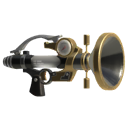
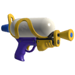
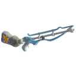
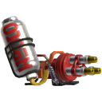
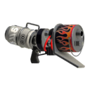
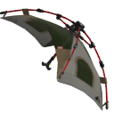
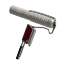
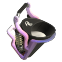

3代的武器图标全部更新（8月25日）

## 单枪

|图标|名称|副武器|特殊武器|
|----|----|----|----|
||新叶射击枪|  |  |
||Sploosh-o-matic| | |
||Splash-o-matic||  |
||斯普拉射击枪| |  |
||N-ZAP85| |  |
||.52加仑|| |
||.96加仑| | |
||顶尖射击枪| | |
||专业模型枪MG|  |  |
||Jet_Squelcher|| |

## 机动枪

|图标|名称|副武器|特殊武器|解放等级|
|----|----|----|----|----|
||溅镀枪|  |!|14|
||斯普拉机动枪| | |3|
||Glooga_Dualies|||21|
||Dualie_Squelchers| | |8|
||四重弹跳手枪|||17|

## 狙击枪
|图标|名称|副武器|特殊武器|解放等级|
|----|----|----|----|----|
||Classic_Squiffer| ||8|
||斯普拉蓄力狙击枪|  | |2|
||斯普准星枪|  | |10|
||公升4K| |  |18|
||4K准星枪| |  |27|
||Bamboozler_14_Mk_I||  | 23|
||Goo_Tuber|| | 25|

## 旋转枪
|图标|名称|副武器|特殊武器|解放等级|
|----|----|----|----|----|
||Mini_Splatling|  | |12|
||桶装旋转枪|  |  |4|
||消防栓旋转枪|||20|
||Ballpoint_Splatling|| |30|
||Nautilus_47| | |28|

## 泡
|图标|名称|副武器|特殊武器|解放等级|
|----|----|----|----|----|
||新星爆破枪|  |||
||火热爆破枪||||
||Range Blaster|| |11|
||Clash_Blaster| |  |22|
||Rapid_Blaster| |  |7|
||Rapid_Blaster_Pro| |  |26|

## 伞
|图标|名称|副武器|特殊武器|解放等级|
|----|----|----|----|----|
||遮阳防空伞|||5|
||露营防空伞| | |16|
||间谍配件| | |18|

## 刷
|图标|名称|副武器|特殊武器|解放等级|
|----|----|----|----|----|
||Carbon_Roller| ||6|
||斯普拉滚筒| ||2|
||电动马达滚筒|| |12|
||Flingza_Roller|| |20|

## 笔
|图标|名称|副武器|特殊武器|
|----|----|----|----|
||巴勃罗|  ||
||Octobrush| ||

## 桶
|图标|名称|副武器|特殊武器|解放等级|
|----|----|----|----|----|
||飞溅泼桶|  ||3|
||洗笔桶| | |10|
||Sloshing_Machine| ||14|
||满溢泡澡泼桶|| |14|
||Explosher| | |29|

## 弓
|图标|名称|副武器|特殊武器|
|----|----|----|----|
||三发猎鱼弓| ||

## 刮水刀
|图标|名称|副武器|特殊武器|
|----|----|----|----|
||雨刷刮水刀|| |
||Splatana_Stamper|| |

---
## 参考资料
- [inkipedia](https://splatoonwiki.org/wiki/Weapon)

