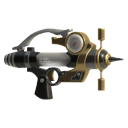
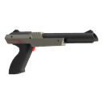
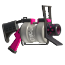
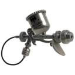
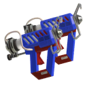
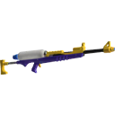
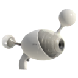
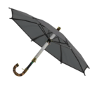
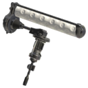
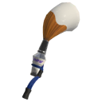

3代的武器图标全部更新（8月25日）

## 单枪

|图标|名称|副武器|特殊武器|
|----|----|----|----|
||新叶射击枪|  |  |
||Sploosh-o-matic| | |
||Splash-o-matic||  |
||斯普拉射击枪| |  |
||N-ZAP85| |  |
||.52加仑|| |
||.96加仑|| | |
||顶尖射击枪| | |
||专业模型枪MG|  |  |
||Jet_Squelcher|| |

## 机动枪

|图标|名称|副武器|特殊武器|
|----|----|----|----|
||斯普拉机动枪| | |
||Glooga_Dualies|||
||四重弹跳手枪|||

## 狙击枪
|图标|名称|副武器|特殊武器|
|----|----|----|----|
||斯普拉蓄力狙击枪|  | |
||斯普准星枪|  | |
||公升4K| |  |
||4K准星枪| |  |

## 旋转枪
|图标|名称|副武器|特殊武器|
|----|----|----|----|
||桶装旋转枪|  |  |
||消防栓旋转枪|||

## 泡
|图标|名称|副武器|特殊武器|
|----|----|----|----|
||新星爆破枪|  ||
||火热爆破枪|||
||Range Blaster|| |
||Rapid_Blaster| |  |

## 伞
|图标|名称|副武器|特殊武器|
|----|----|----|----|
||遮阳防空伞|||
||露营防空伞| | |
||间谍配件| | |

## 刷
|图标|名称|副武器|特殊武器|
|----|----|----|----|
||斯普拉滚筒| ||
||电动马达滚筒|| |
||Flingza_Roller|未知| |

## 笔
|图标|名称|副武器|特殊武器|
|----|----|----|----|
||巴勃罗|  ||
||Octobrush| ||

## 桶
|图标|名称|副武器|特殊武器|
|----|----|----|----|
||飞溅泼桶|  ||
||洗笔桶| | |

## 弓
|图标|名称|副武器|特殊武器|
|----|----|----|----|
||三发猎鱼弓| ||

## 刮水刀
|图标|名称|副武器|特殊武器|
|----|----|----|----|
||雨刷刮水刀|| |

---
## 参考资料
- [inkipedia](https://splatoonwiki.org/wiki/Weapon)

