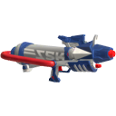
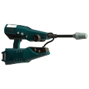
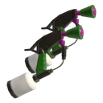
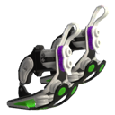
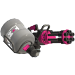
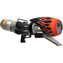
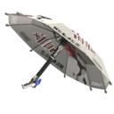
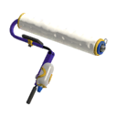
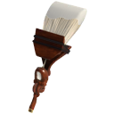

## 单枪

|图标|名称|副武器|特殊武器|
|----|----|----|----|
||Splattershot Jr.|  |  |
||Sploosh-o-matic| | |
||Splash-o-matic||  |
||Splattershot| |  |
||N-ZAP_'85| |  |
||.52_Gal|| |
||.96_Gal| | |
||Splattershot_Pro| | |
||Aerospray_MG|  |  |
||Jet_Squelcher|| |

## 双枪

|图标|名称|副武器|特殊武器|
|----|----|----|----|
||Splat_Dualies| | |
||Glooga_Dualies|||
||Dark_Tetra_Dualies|||

## 加特林
|图标|名称|副武器|特殊武器|
|----|----|----|----|
||Heavy_Splatling|  |  |
||Hydra_Splatling|||

## 泡
|图标|名称|副武器|特殊武器|
|----|----|----|----|
||Luna_Blaster|  ||
||Blaster|||
||Range Blaster|| |

## 伞
|图标|名称|副武器|特殊武器|
|----|----|----|----|
||Splat_Brella|||
||Undercover_Brella| | |

## 刷
|图标|名称|副武器|特殊武器|
|----|----|----|----|
||Splat_Roller| ||

## 笔
|图标|名称|副武器|特殊武器|
|----|----|----|----|
||Octobrush| ||

## 桶
|图标|名称|副武器|特殊武器|
|----|----|----|----|
||Slosher|  ||

## 弓
|图标|名称|副武器|特殊武器|
|----|----|----|----|
||Stringer| ||

## Splatana
|图标|名称|副武器|特殊武器|
|----|----|----|----|
||Splatana|| |

---
## 参考资料
- [inkipedia](https://splatoonwiki.org/wiki/Weapon)

