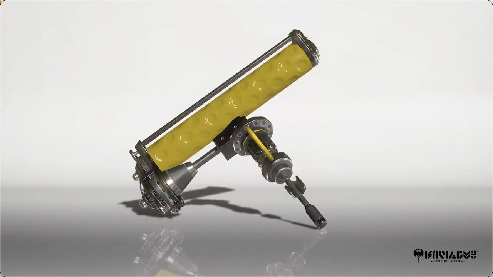

## 前言
> 5月23日，官方介绍了喷3的滚筒（刷子）。和1,2代一样，有中刷和中刷哦。
> 根据官方描述，性能也和以前一样。副武器和大招暂时还没公布。
> （中刷的副武器和大招在演示视频貌似有提及。）

## 外观

## 特征

它是一个沉重的滚筒，摆动缓慢，但可以用墨水攻击一个广泛的区域。它有很长的垂直摆动距离，使它能够在远处击倒对手。这次似乎将机械部分打开，以防止热量积聚。

---

##### 参考资料:  
- <small>[Splatoon offcial twitter](https://twitter.com/SplatoonJP/status/1528662017535787008?s=20&t=RxoAVK4Ibbq1AuQlJP4iyA)</small>

