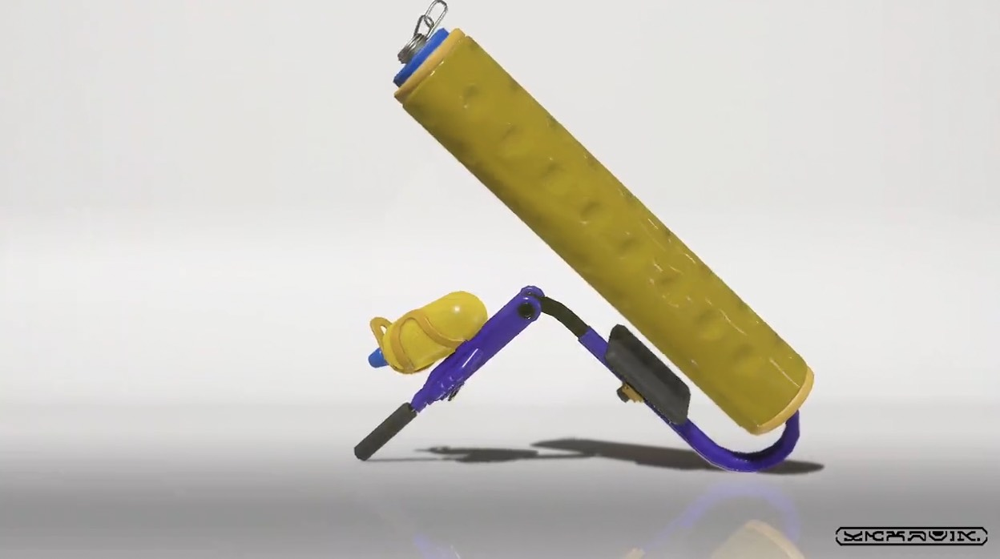

## 基础信息
### 信息卡
| 图像 | 系统类别 | 副武器 | 特殊武器 | 攻击力 | 射程 | 射速 | 购买等级 |
| ---- | -------- | ------ | -------- | ---- | ---- | ---- | -------- |
| 4    | 刷子     | 未知   | 未知     | 48   | 45   | 55   | 未知       | 

 5月23日，官方介绍了喷3的滚筒（刷子）。和1,2代一样，有中刷和中刷哦。根据官方描述，性能也和以前一样。副武器和大招暂时还没公布。（中刷的副武器和大招在演示视频貌似有提及。）

### 外观

### 特征
通过在移动时按住ZR按钮，辊子能够在涂抹油墨时前进。

通过摆动滚筒，你可以把墨水送到你面前。
有各种不同的滚筒，有不同的油漆区域和速度，也有不同的油墨范围和距离，所以要选择最适合你的滚筒。 

这是一种擅长于近身战斗的武器。与其他滚筒相比，它的怪癖较少，而且更容易操作，使其成为游戏的理想入门。如果你能根据情况在地面上水平使用，在空中垂直使用，你可以期待更大的效果。 

它是一个沉重的滚筒，摆动缓慢，但可以用墨水攻击一个广泛的区域。它有很长的垂直摆动距离，使它能够在远处击倒对手。这次似乎将机械部分打开，以防止热量积聚。

## 版本更新记录
暂无

--- 

##### 参考资料:  
- [<small> Splatoon offcial twitter</small>](https://twitter.com/SplatoonJP/status/1528662017535787008?s=20&t=RxoAVK4Ibbq1AuQlJP4iyA) 

